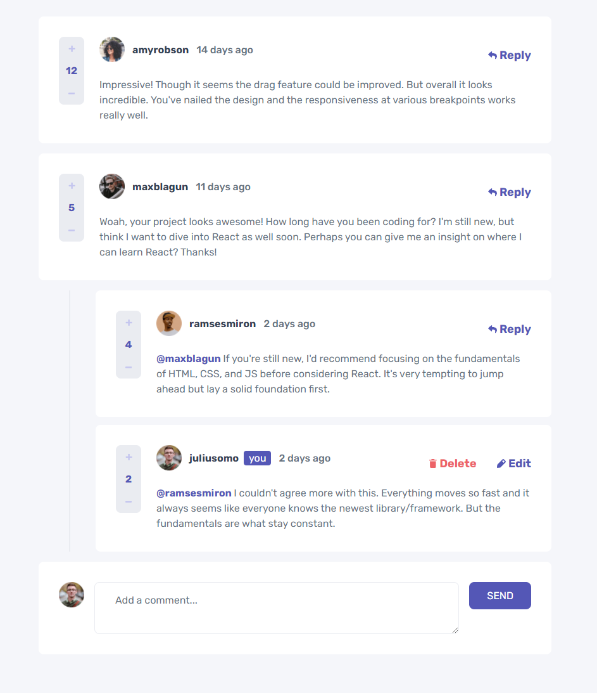

<h1 align="center">
  Comments Section
</h1>

<h3 align="center">
<strong>Project based on <a href="https://www.frontendmentor.io/challenges/interactive-comments-section-iG1RugEG9" target="_blank">Frontend Mentor Challenge </a></strong>
</h3>

  
  
  
  
   
   
  <a href="#space_invader-technologies">Technologies</a>
   
   
  
   
  <a href="https://shiga-comments-section.vercel.app/" target="_blank">
    <h3 align="center"><b>VISIT</b></h3>
  </a>
   

## :space_invader: Technologies

- [NextJS](https://nextjs.org/)
- Typescript
- Styled Components
- focus-trap-react
- date-fns
